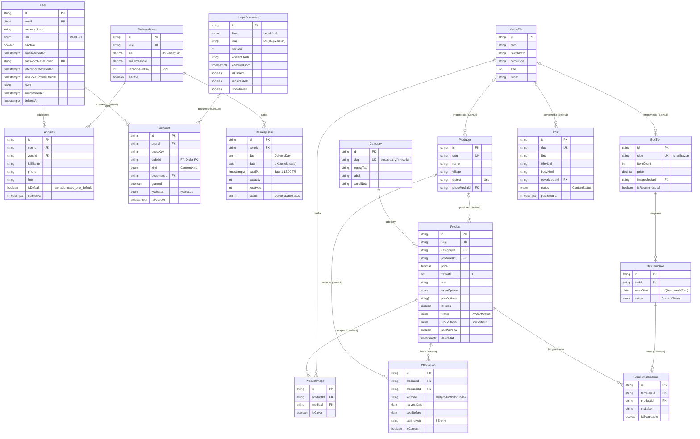
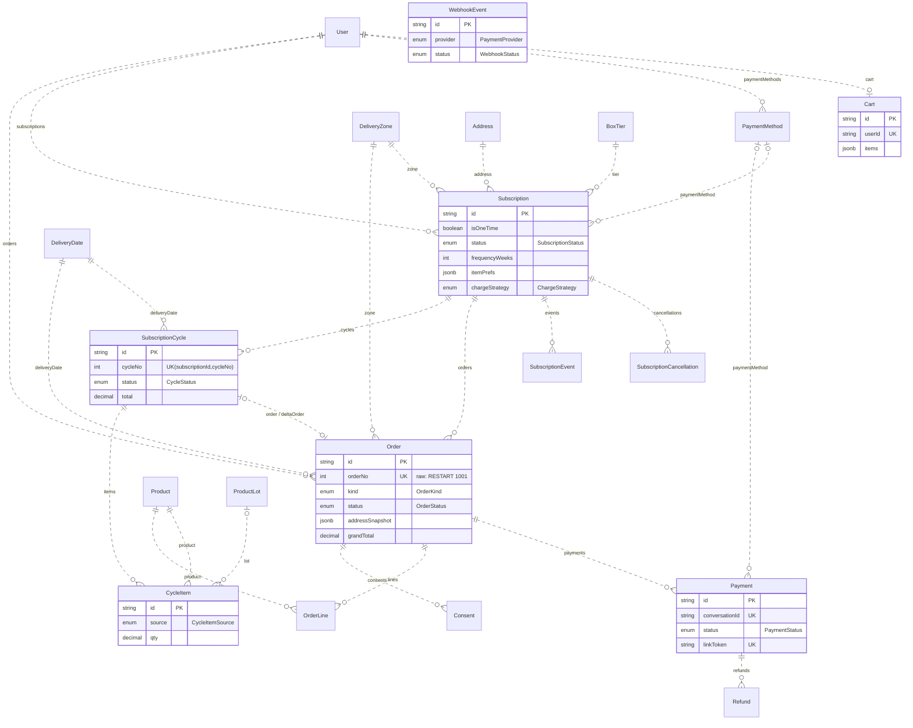

# Bağdam — ERD (F2a şeması)

> Kaynak: [`database/schema.prisma`](../database/schema.prisma) (F2a) · gerekçe: [BACKEND-PLANI.md §2](BACKEND-PLANI.md) · kararlar: ADR-0004 (Timestamptz), ADR-0005 (kesim/bölge), ADR-0008 (abonelik modeli), ADR-0013 (F2a/F2b, additive migration).
> Bu dosya F2'de üretildi; F7'de F2b varlıkları eklenince güncellenir.

## Özet

- **Tablo sayısı:** 23 (F2a) + `_prisma_migrations`. **Enum:** 27 (F2b dahil; `packages/shared/src/enums.ts` ile birebir — doğrulama: ad + sıralı değer listesi).
- **Migration zinciri:** `20260820000000_extensions` (citext) → `20260820130020_init_core` (F2a tabloları) → `20260820130055_raw_core` (`addresses_one_default` kısmi benzersiz indeks). F7: `*_commerce` + `*_raw_commerce`.
- **Zaman:** tüm an alanları `TIMESTAMPTZ(3)` (41 kolon; `timestamp without time zone` yok), takvim günleri `DATE` (`DeliveryDate.date`, `BoxTemplate.weekStart`, `ProductLot.harvestDate/bestBefore`).
- **Adlandırma:** tablolar snake_case (`@@map`), kolonlar camelCase (alanlarda `@map` yok → ham SQL'de `"userId"` gibi tırnaklı yazılır).
- **Tek sahip kuralı [B11]:** kargo/eşik → `DeliveryZone`; kesim+kapasite → `DeliveryDate`; kategori paneli notu → `Category.panelNote`; ürün "why" → `ProductLot.tastingNote`; cycle içeriği → `BoxTemplate`.
- **Şema-var/UI-yok (ADR-0013):** `Address.isDefault`, `Producer.story/photoMedia`, `WholesaleLead.businessName`, `BoxTemplate.curatorName`.

## F2a — varlıklar ve ilişkiler

### Bağımsız tablolar (ilişkisiz)

| Tablo | Model | Not |
|---|---|---|
| `wholesale_leads` | WholesaleLead | `email` citext; `status` LeadStatus |
| `site_content` | SiteContent | `key` PK; `schema` + `value` jsonb (anahtarlar: BACKEND-PLANI §2) |
| `settings` | Setting | `key` PK, `group` indexli; `isSecret` (panelden girilir) |
| `audit_logs` | AuditLog | silinmez; PII anonimleştirmede maskelenir |
| `mail_logs` | MailLog | `UK(templateSlug, entityId)`; 90 gün |
| `system_logs` | SystemLog | fingerprint + occurrenceCount; 30 gün |
| `cron_logs` | CronLog | `idx(name, startedAt)`; 90 gün |

## F2b — F7'de eklenecek varlıklar (noktalı = henüz yok)

`0003_commerce` ile gelir: Cart, Order, OrderLine, PaymentMethod, Payment, Refund, WebhookEvent, Subscription, SubscriptionCycle, CycleItem, SubscriptionEvent, SubscriptionCancellation. F2a modellerindeki karşı ilişkiler (`User.orders/subscriptions/paymentMethods/cart`, `DeliveryZone.subscriptions/orders`, `DeliveryDate.cycles/orders`, `Address.subscriptions`, `Product.orderLines/cycleItems`, `ProductLot.cycleItems`, `BoxTier.subscriptions`, `Consent.order`) şemada `// F2b:` yorumu olarak bekliyor; `Consent.orderId` şimdiden ilişkisiz `String?` (FK additive eklenir).

## Doğrulama (lokal, 2026-08-20)

- `pnpm db:validate` ✓ · `prisma format` temiz ✓ · `pnpm db:status` → "Database schema is up to date!" ✓
- `psql`: 23 tablo, `citext` 1.8 kurulu, `users.email` tipi `citext`, `addresses_one_default` kısmi benzersiz indeks mevcut, 41 `timestamptz` kolon / 0 `timestamp` kolon ✓
- Migration SQL'lerinde PG 14 dışı sözdizimi yok (jsonb, citext, text[], kısmi indeks, enum — hepsi PG 14'te var) ✓
- `GET /api/v1/health` → `{"status":"ok","db":"up",…}` ✓
