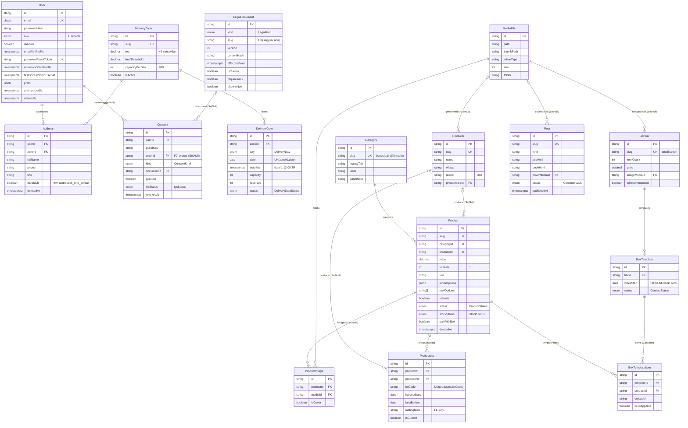
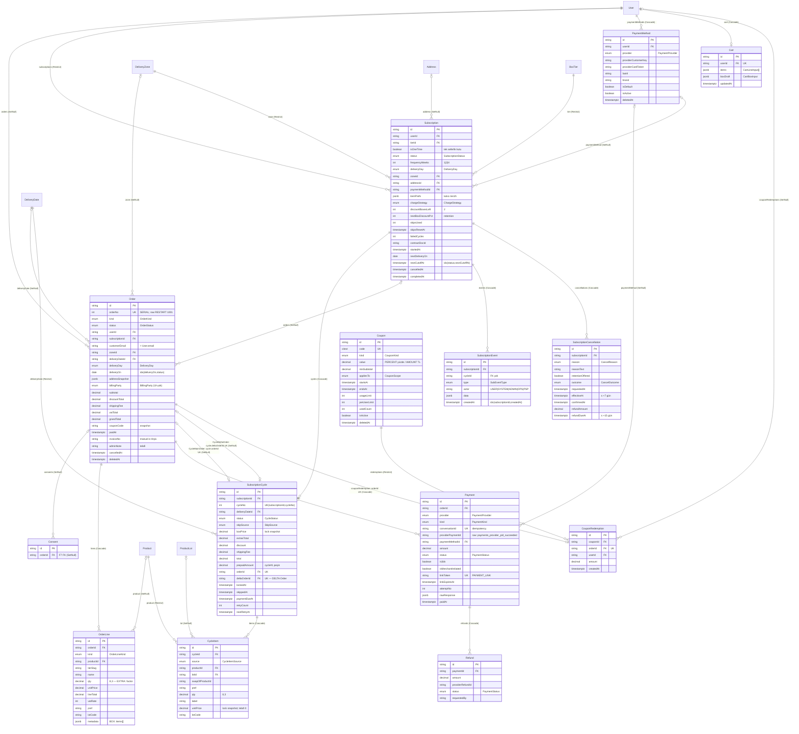

# Bağdam — ERD (F2a + F2b şeması)

> Kaynak: [`database/schema.prisma`](../database/schema.prisma) · gerekçe: [BACKEND-PLANI.md §2](BACKEND-PLANI.md) · kararlar: ADR-0004 (Timestamptz), ADR-0005 (kesim/bölge), ADR-0006 (tahsilat/DELTA), ADR-0007 (indirim/atlama/retention), ADR-0008 (abonelik modeli), ADR-0010 (ödeme), ADR-0013 (F2a/F2b, additive migration), ADR-0016 (kupon UI P2).
> F2'de üretildi (F2a); **F7 1. gününde F2b varlıkları + minimal Coupon eklendi (2026-08-20)**. Durum geçişleri: [state-machines.md](state-machines.md).
> **F10 sonu (2026-08-21): şema v1 DONDURULDU — [ADR-0021](adr/0021-sema-v1-donduruldu.md).** Aşağıdaki 37 model / 29 enum / 5 migration
> sayımı bundan sonra referanstır; yalnız **additive** migration serbesttir (yeni tablo · nullable kolon · index · enum değeri · FK).
> Kolon/tablo silme, yeniden adlandırma, tip daraltma, enum değeri kaldırma **yeni ADR ister**.

## Özet

- **Tablo sayısı:** 37 = F2a 23 + F2b 12 (Cart, Order, OrderLine, PaymentMethod, Payment, Refund, WebhookEvent, Subscription, SubscriptionCycle, CycleItem, SubscriptionEvent, SubscriptionCancellation) + Coupon 2 (Coupon, CouponRedemption) — DB'de 38 (`_prisma_migrations` ile). **Enum:** 29 (F7: `CouponKind`, `CouponScope`); `packages/shared/src/enums.ts` ile birebir — doğrulama: ad + sıralı değer listesi + `*_VALUES` + `*_LABELS`.
- **Migration zinciri:** `20260820000000_extensions` (citext) → `20260820130020_init_core` (F2a) → `20260820130055_raw_core` (`addresses_one_default`) → `20260820183243_commerce` (F2b + Coupon + F2a karşı ilişkiler + `consents.orderId` FK) → `20260820183416_raw_commerce` (`"orders_orderNo_seq"` RESTART 1001; `payments_provider_pid_succeeded` kısmi benzersiz indeks).
- **Zaman:** tüm an alanları `TIMESTAMPTZ(3)` (78 kolon: F2a 41 + F2b 37; `timestamp without time zone` yok), takvim günleri `DATE` (`DeliveryDate.date`, `BoxTemplate.weekStart`, `ProductLot.harvestDate/bestBefore`, `Order.deliveryOn`, `Subscription.nextDeliveryOn`).
- **Adlandırma:** tablolar snake_case (`@@map`), kolonlar camelCase (alanlarda `@map` yok → ham SQL'de `"userId"`, `"providerPaymentId"`, `"orders_orderNo_seq"` gibi tırnaklı).
- **Tek sahip kuralı [B11]:** kargo/eşik → `DeliveryZone`; kesim+kapasite → `DeliveryDate`; kategori paneli notu → `Category.panelNote`; ürün "why" → `ProductLot.tastingNote`; cycle içeriği → `BoxTemplate`; kalıcı ürün tercihi → `Subscription.itemPrefs`; fiyat snapshot'ı → `Order/OrderLine` (ödendikten sonra değişmez) ve kilitte `SubscriptionCycle/CycleItem`.
- **Snapshot / idempotency:** `Order` ödendikten sonra değişmez, kesim sonrası eklemeler DELTA Order (`SubscriptionCycle.deltaOrderId`); `Payment.conversationId` unique + `payments_provider_pid_succeeded`; `WebhookEvent @@unique(provider, eventType, providerRef)`; `SubscriptionCycle @@unique(subscriptionId, cycleNo)`; `CouponRedemption.orderId` unique (sipariş başına ≤1 kupon).
- **Şema-var/UI-yok (ADR-0013/0016):** `Address.isDefault`, `Producer.story/photoMedia`, `WholesaleLead.businessName`, `BoxTemplate.curatorName`, **`Cart`** (üye sepeti merge P2), **`Order.billing*`** (kurumsal fatura — admin'den), **`SubscriptionStatus.PAUSED`**, **`Coupon` / `CouponRedemption`** (kod girişi + admin ekranı 23 P2; `Order.couponCode` snapshot, Coupon'a FK yok).

## F2a — varlıklar ve ilişkiler

### Bağımsız tablolar (ilişkisiz)

| Tablo | Model | Not |
|---|---|---|
| `wholesale_leads` | WholesaleLead | `email` citext; `status` LeadStatus |
| `site_content` | SiteContent | `key` PK; `schema` + `value` jsonb (anahtarlar: BACKEND-PLANI §2) |
| `settings` | Setting | `key` PK, `group` indexli; `isSecret` (panelden girilir) |
| `audit_logs` | AuditLog | silinmez; PII anonimleştirmede maskelenir |
| `mail_logs` | MailLog | `UK(templateSlug, entityId)`; 90 gün |
| `system_logs` | SystemLog | fingerprint + occurrenceCount; 30 gün |
| `cron_logs` | CronLog | `idx(name, startedAt)`; 90 gün |
| `webhook_events` | WebhookEvent (F2b) | PSP webhook idempotency `UK(provider, eventType, providerRef)` → çift teslim IGNORED; `payload` jsonb, `signatureValid` |

## F2b — sepet / sipariş / ödeme / abonelik motoru / kupon (F7, `0003_commerce` + `0004_raw_commerce`)

F2a modellerindeki karşı ilişkiler artık gerçek: `User.orders/subscriptions/paymentMethods/cart/couponRedemptions`, `DeliveryZone.subscriptions/orders`, `DeliveryDate.cycles/orders`, `Address.subscriptions`, `Product.orderLines/cycleItems`, `ProductLot.cycleItems`, `BoxTier.subscriptions`, `Consent.order`. `onDelete` kuralı: bağımlı satırlar **Cascade** (lines, payments, refunds, cycles, items, events, cancellations, cart, payment_methods, coupon_redemptions←order), referans/snapshot bağları **SetNull** (Order→user/zone/deliveryDate/subscription, OrderLine→product, Payment→paymentMethod, Subscription→address/paymentMethod, CycleItem→lot, Consent→order, CouponRedemption→user), silinmesi engellenenler **Restrict** (Subscription→user/tier/zone, SubscriptionCycle→deliveryDate, CycleItem→product, CouponRedemption→coupon).

### F2b ham SQL (`0004_raw_commerce`)

| SQL | Amaç |
|---|---|
| `ALTER SEQUENCE "orders_orderNo_seq" RESTART WITH 1001;` | Sipariş numaraları 1001'den başlar (`Order.orderNo` SERIAL, müşteriye görünen no) |
| `CREATE UNIQUE INDEX "payments_provider_pid_succeeded" ON "payments"("provider","providerPaymentId") WHERE "status"='SUCCEEDED';` | Aynı sağlayıcı ödeme kimliği tek bir başarılı Payment'ta — callback/webhook çift teslimine karşı idempotency (state-machines.md §4) |

## Doğrulama (lokal, 2026-08-20 — F7 1. gün)

- `prisma format` temiz ✓ · `pnpm db:validate` ✓ · `pnpm db:migrate` (`0003_commerce` + `0004_raw_commerce`) uygulandı · `pnpm db:status` → "Database schema is up to date!" (5 migration) ✓ · `pnpm db:generate` ✓ (client 37 model)
- `psql`: 38 tablo (37 + `_prisma_migrations`), 29 enum, `orders_orderNo_seq` başlangıç 1001 (`is_called=false` → ilk sipariş 1001), `payments_provider_pid_succeeded` kısmi benzersiz indeks mevcut, `coupons.code` tipi `citext`, `consents_orderId_fkey` (SET NULL), **78 `timestamptz` kolon / 0 `timestamp`** (F2b 37/37) ✓
- Enum paritesi: 29 Prisma enum ↔ `packages/shared/src/enums.ts` (ad, sıralı değer, `*_VALUES`, `*_LABELS`) birebir ✓ (`consistency.test.ts` + ayrıca script ile)
- `pnpm --filter @bagdam/shared type-check && test` ✓ (117 vitest) · `pnpm --filter @bagdam/api type-check` ✓ · API jest (gerçek DB) ✓ — F2a ilişkilerinin eklenmesi mevcut sorguları bozmadı
- Migration SQL'lerinde PG 14 dışı sözdizimi yok (jsonb, citext, enum, SERIAL, kısmi indeks) ✓
